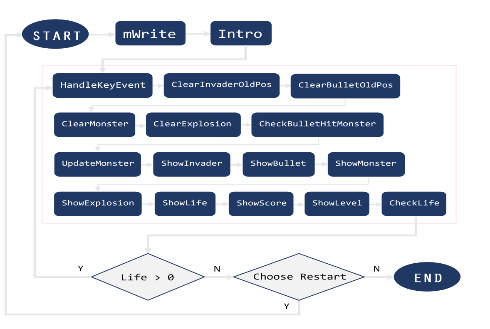

# Space-Invader
## 遊戲玩法
怪物會隨機的從天而降，玩家用鍵盤(A和D)操控射擊器，使用空白鍵發射子彈保衛地球，在死亡之前擊敗所有的怪物，達到指定分數可以前往下一關，按ESC可以結束遊戲。  
分數設定：第一關(3分)→第二關(5分)→第三關(10分)→勝利

----

## 函式介紹
### 游標設定
**Intro**				        ; 初始化畫面  
**MWrite**			        ; 顯示畫面巨集  
**ShowInvader**			    ; 顯示游標位置  
**ClearInvaderOldPos**	; 清除舊的游標位置  
**HandleKeyEvent**		  ; 判斷鍵盤輸入  

**初始化畫面 Intro**  
設定好螢幕介面以及顏色，還有長與寬度，然後用迴圈輸出黑色的空白，讓整個螢幕變成黑色。  
會這樣寫的原因是如果未來有需要改變顏色可以很快地進行修正，不需要再重新寫一段。

**顯示畫面巨集 MWrite**  
這個巨集是要用來顯示遊戲規則以及所有的訊息，包含三個部分，第一個部分是清除螢幕，第二個部分是設定位置，並且用gotoxy定位游標，第三個部分則是根據第幾關輸出對應的訊息，顯示訊息的部分是用writestring，而顯示的內容再前面的data有先進行定義。  
使用巨集的原因之一，是為了要讓程式碼看起來更簡潔。

**顯示游標位置 ShowInvader**  
這個函式的目的是要顯示游標的位置，設定了顏色、大小以及位置，然後使用writestring的方式，印出了一個空白按鍵，為了使程式撰寫更為方便，在顏色的部分我們都已全域變數來代替區域變數。
有使用到setTextcolor，gotoxy，writeString。

**清除舊的游標位置 ClearInvaderOldPos**  
這個函數在做的事情是要把剛剛所產生的空白給刪掉，給玩家一種有在進行即時控制的感覺。  
做法是先找到舊的游標並且設定顏色、大小及位置，然後使用writestring，印出背景顏色的空白按鍵，當中有使用到setTextcolor，gotoxy，writestring。

**判斷鍵盤輸入 HandleKeyEvent**  
這個函式式用來判斷玩家所進行的鍵盤輸入，用delay先製造個延遲，然後用readkey進行判斷。  
如果是a，會讓玩家控制的游標往左一格。  
如果是d，會讓游標往右，鍵盤中的左右鍵也有同樣的功能。  
如果輸入的是空白，會呼叫另物個函式，叫做activatebullet，則會把子彈的游標變成1，發射出子彈。  
如果是esc，則會把quitflag設成1，在進行下一次的迴圈時，就會跳出遊戲。

### 怪物設定
**ShowMonster**			        ; 顯示怪物  
**ClearMonster**			      ; 清除怪物  
**UpdateMonster**		        ; 更新怪物位置
**ClearMonsterLine**        ; 清除舊有的怪物位置
**CheckBulletHitMonster**		; 擊中判定

**顯示怪物 ShowMonster**  
用SetTextColor設定怪物顏色，接著利用Gotoxy定好怪物的座標(MonsterX和MonsterY)，並利用WriteString將怪物用在變數MonsterSymbol中設定好的形狀列印出來。

**清除怪物 ClearMonster**  
利用SetTextColor將怪物顏色設成背景顏色，跟顯示怪物的方法相同，利用Gotoxy定好座標(MonsterX和MonsterY)，並利用WriteString將怪物用在變數MonsterResetSymbol中設定好的形狀列印出來。

**更新怪物位置 UpdateMonster**  
用explosionFlag檢查是否擊中怪物，若為1則跳到resetMonsterPostion，呼叫ClearMonsterLine，再重設MonsterX與MonsterY座標，其中，MonsterY會被設為MonsterInitY(初始值0，因為從最上面掉下來)，而MonsterX採用Randomize的方式亂數產生位置，而非使用RandomRange所產生相同順序的亂數。  
若explosionFlag不為1，則檢查MonsterY座標是否碰到底部，如果還沒碰到就遞增Y座標，但如果碰到就跳到Monsterhitboundry，把MonsterHitBoundryFlag設為1，代表怪物已到達下邊界，並重設explosionFlag和怪物顏色，接著同樣繼續resetMonsterPostion，重設怪物的位置。

**清除舊有的怪物位置 ClearMonsterLine**  
將原本的怪物列(Y)設成背景顏色，利用WriteString印出，目的為更新怪物位置(因為在函式UpdateMonster內會遞增MonsterY座標)。

**擊中判定 CheckBulletHitMonster**  
使用EAX暫存器來判斷子彈的X座標、Y座標和怪獸的X座標、Y座標是否相同，其中Y座標可以相差1或0是因為有時會碰到子彈和怪獸剛好錯開的情況，例如BulletY=3，MonsterY=2，在一個時間後，BulletY變2，而MonsterY變3，剛好造成不會相等的情形。  
而子彈在X座標方向須介於怪獸的長度，因此BulletX需比較兩次，那麼如果座標相同就把explosionFlag設為1，讓他到showExplosion判斷是否爆炸。  

### 關卡設定
**ShowLife**			; 顯示生命  
**CheckLife**			; 生命判定  
**ShowScore**			; 顯示分數  
**ShowLevel**			; 顯示關卡  

**顯示生命 ShowLife**  
若生命值大於1，會跳至nowarning，就維持原狀。  
若只剩1，則改變顯示之顏色，並設置一個觸發器lifeWarningToggle來產生閃爍的顏色變換效果，達到警告的感覺。  
以WriteDec來顯示life值。

**生命判定 CheckLife**  
一開始以secondroundFlag和thirdroundFlag判斷是已進入過第二或第三關，當已進入過第二或第三關，secondroundFlag或thirdroundFlag會設成1，且分別跳至L6或L7來顯示進入第二或第三關的訊息。  
若已進入過第二或第三關就不須再比較score是否達到第二或第三關結束規定的分數。便可來比較是達到第三關過關條件是分數(winScore)。達成的話就顯示win的訊息。  若還未達到winscore之分數會跳至L4，來判斷還有沒有命，若沒有命了就跳至L0來顯示lose的訊息，若玩家選擇要繼續玩就跳至L1來初始化各值。

**顯示分數 ShowScore**  
以WriteString來顯示scoreMsg，若無射到怪物(explosionFlag = 0)，就跳至remain，用WriteDec顯示目前分數。若射到怪物(explosionFlag = 1)，就將分數加一，並將explosionFlag設成2(為了之後的ClearExplosion)，再至remain顯示分數。  

**顯示關卡 ShowLevel**
以WriteString來顯示levelMsg。若還沒進到第二關(secondroundFlag = 0)就跳至remain維持原顯示關卡。  
若進到第二關(secondroundFlag = 1)，則將關卡數設為2。再繼續判斷thirdroundFlag，若等於0則跳至remain顯示關卡為2，若為1則設置關卡數為3再至remain顯示關卡數。

### 子彈設定
**ShowBullet**			; 顯示子彈位置  
**ClearBulletOldPos**		; 清除舊子彈位置  
**ShowExplosion**			; 顯示爆炸畫面  
**ClearExplosion**			; 清除舊爆炸畫面  

**產生爆炸 ShowExplosion**  
判斷explosionFlag是否為0，若為0則ret 不爆炸，若為1則顯示爆炸。  
用SetTextColor設定爆炸顏色，接著利用子彈的座標(BulletX和BulletY)去設定相對應的爆炸四個方形的位置(ah和al)	，並且將爆炸位置記錄在particleX和particleY供之後的clearExplosion使用，最後利用WriteString印出來，最後將子彈位置重設並改變怪獸顏色。

**清除爆炸 ClearExplosion**  
在showScore擊中怪獸得分時，會將explosionFlag設為2。  
在clearExplosion，我們會先比較explosionFlag是否為2，如果不是，代表怪獸沒有被消除，不須產生爆炸。接著將顏色設為背景顏色，然後利用particleX和particleY將之前產生的爆炸蓋過去，最後把explosionFlag重設為0。

----

## 引入函式庫
**FROM Irvine Library**
name | description
---- | ----
Clrscr | Clears the screen by writing blanks to all positions.
Delay | Delays (pauses) the current process for a given number of milliseconds.
ReadKey | Performs a no-wait keyboard check and reads a single character if available.
Readchar | Reads a single character from standard input and returns the character in the AL register.
SetTextColor | Changes the color of all subsequent text output.
Gotoxy | Locates the cursor at a given row and column in the screen's console buffer.  (DL = column  DH = row)
WriteString | Writes a null-terminated string to standard output.
WriteDec | Writes an unsigned 32-bit decimal number to standard output in decimal format with no leading zeros.
Randomize | Re-seeds the random number generator with the current time in hundredths of seconds.
RandomRange | Generates an unsigned pseudo-random 32-bit integer in the range of 0 through (n-1).
MsgBoxAsk | Displays a graphical popup message box with Yes and No buttons.

**FROM Macros**
name | description
---- | ----
mWrite | Writes a string literal (no terminal null) to standard output.

**FROM Windows Library**
name | description
---- | ----
ExitProcess | Ends a process and all its threads.

----

## 流程圖

